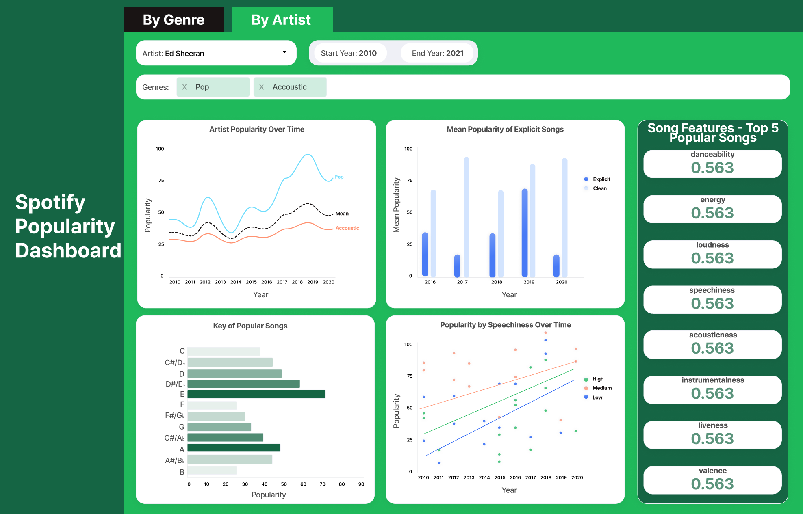

# Proposal - Spotify Popularity Dashboard

Rachel Bouwer, Koray Tecimer, He Ma, Yimeng Xia

## Motivation and Purpose

Our role: Data scientist consultancy firm

Target audience: Record Companies

One of the biggest sectors in the entertainment industry in terms of market size is music. It was valued at USD 27,898.47 million in 2022 according to Industry Research Co. In this huge economy, record companies can strategize in a data driven way to make smart investments to artists - but it might not be clear which artists are worth investing in. To address this issue, we will create a dashboard application that will be easy to browse thorough artists and genres. Record labels will be able to see which factors play into account for artists and songs to be popular. Our app will allow them to identify past songs and evaluate current artists, but also give them ideas on which artist they should invest next. Our app will allow users to filter artists and genres and show plots that will allow them to compare artists and also factors that make that artist popular or unpopular.

## Description of the Data
We will be working with a dataset from [Kaggle](https://www.kaggle.com/) comprising [Spotify tracks and artists.](https://www.kaggle.com/datasets/yamaerenay/spotify-dataset-19212020-600k-tracks/data) The `tracks` dataset has 586,672 records and 20 variables. The `artists` dataset provides additional insights with 1,162,095 records across 5 variables. Together, these datasets offer deep insights into the musical features and popularity of the tracks, which are vital for strategic planning in the music industry.

The variables in the `tracks` dataset fall into several key categories:

* **Identification**:  including `id`, `name`, `artists`, and `id_artists`.  These variables can help in the unique identification of each track.
* **Popularity**: Our variable of interest, `popularity`, reflects the listener engagement and is crucial for understanding listener behavior and making data-driven decisions in the music industry..
* **Release Date**: release date for every track. We will standardize this to capture only the release year and filter out tracks from the last 20 years in the dataset (2000 - 2020) to focus our analysis on contemporary trends and reduce dataset size.
* **Musical Features** : variables that quantify the musical elements, including `danceability`, `energy`, `key`, `loudness`, `mode`, `speechiness`, `acousticness`, `instrumentalness`, `liveness`, and `valence`.
* **Temporal Features** :  `duration_ms`, `tempo`, and `time_signature` offer insights into the rhythm and length of the tracks.
* **Categorical Data** : The `explicit` variable is a binary categorical variable indicating whether a track contains explicit content.

Additionally, we plan to engineer new categorical variables from the `speechiness` and `liveness` features to aid in the visualizations and analysis.
`speechiness_category`: categorize tracks into  `High Speechiness` for speechiness values above 0.66, `Medium Speechiness` for speechiness values between 0.33 and 0.66 and `Low Speechiness` for speechiness values below 0.33, which can help to identify the types of songs that are most popular.
`live `: classify tracks as `Live` for liveness values above 0.8 and `Not Live` for liveness values at or below 0.8. This can inform producers and labels about the potential benefits of investing in live albums.

In the `artists` dataset, the variables `id`, `name`, `followers`, `genres`, and `popularity` help us understand the artists' reach, their genre associations, and engagement levels within the music industry. Our focus will be particularly on the `genres` and `popularity` variables for this part of the dataset.

Our project will focus on the two aspects: genre and artists, that are pivotal for investment decisions within the music industry. Our project will study a series of selected features that hold the key to understanding track popularity, including `danceability`, `energy`, `valence`, `loudness`, `acousticness`, `instrumentalness`, `speechiness`and `liveness`, and two newly derived features:  `speechiness_category `and `live` as well. By looking at the `release_date`, we can also see how the popularity of different genre or these special features change over the years.

## Research Questions

## App Sketch and Description

The Spotify Popularity Dashboard is comprised of two lab views - 'By Genre' and 'By Artist'. The 'By Genre' tab allows you to select one genre and explore the popularity of artists and songs in the given genre. Similarly, the 'By Artist' tab allows you to select one artist and browse the popularity of this artist across the songs in their different genres. Common across both tabs is the 'Song Features - Top 5 Popular Songs' statistics (on the right) where the average values across the different features of the top 5 popular songs that match the selected criteria are displayed. For each of the four views, there are four different plots (in the middle of the screen) that give insights on how features of the given subset of songs are related to popularity. Finally, above the plots are where you can customize the view which includes a drop down (to select either one genre or one artist), a date range picker to choose the time frame you wish to analyze, and a bar allowing you to select either multiple artists in a given genre (By Genre view), or multiple genres for a given artist (By Artist view).

### 'By Genre' View

 

### 'By Artist' View

 

